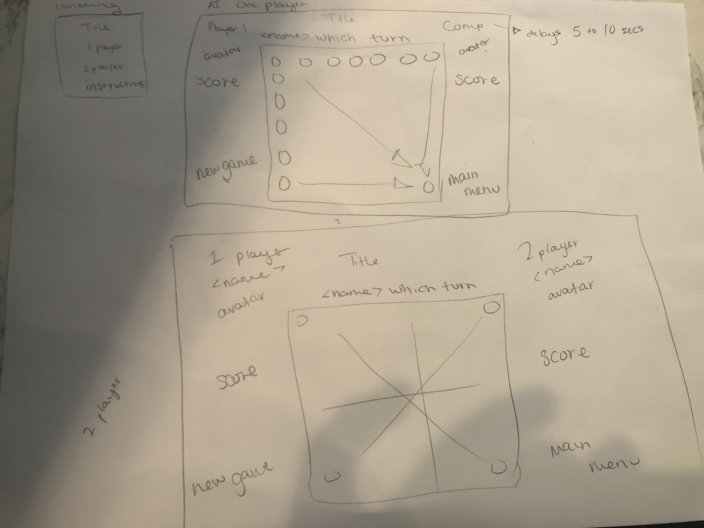

# Connect 4 Project

# Overview
For project #1, I created a game of Connect 4.

Once players come to the site, they are asked if it is a 1 player or 2 player game. If one player input one name, if two players then both names. Once name(s) are inputted, you can choose the emoji avatar off the list. Now its time to play the game. The goal of the game is to get 4 of your emojis in a line whether it is vertical, horizontal, or diagonal before your opponent.

# Pre-Planning

# Project Planning & User Stories - Trello

- New Game Button
- Back to Home Button
- Instructions Modal Button

Trello: https://trello.com/b/97uhdZ2r/

# References Used

Live site: https://confident-almeida-0655bf.netlify.com/

Referenced Cody Seibert on github and youtube tutorial
https://github.com/codyseibert/js-connect-four
https://www.youtube.com/watch?v=zIreWkKfChE

I used https://www.photocollage.com/ to make the background for the landing page. I saw a photo like that but all of them had watermarks. So I made my own.

# Technologies Used

-  HTML
-  CSS
-  Javascript
-  jQuery
-  Animate.css
-  Sweet Alerts

# Next Version

- Choose emoji avatars toggle

- Emoji's pop out of button & also 

- Avatar drop into game board on turn as the playing coin

- Input name modal for player 1 and 2

- Add score

- Add AI to play against computer

- Add music

- Player avatar enlarges once they win out of screen then refreshes

- Emoji coins fall out of bottom

